Second round of quality control of G x G behavior data
================

Backgroud
---------

I conducted an experiment in which copepods were infected with a tapeworm parasite. Their behavior was recorded seven times post-infection, spanning the development of the parasite in the copepod. I initially explored some quality-control problems with the data [here](quality_control_behav_data1.ipynb). Now, I am making exploratory plots to identify and clarify other problem cases.

Here is what the data looks like for one copepod on one observation day. Each copepod has a unique identifier `cop_name`, and the file name `fname` is a combination of `cop_name` and day-post-exposure `day`. Copepod behavior was tracked over two minutes, with copepod position being recorded every two seconds, hence the 62 `slices`. The response variable is the distance moved by the copepod `dist`. The `pixel` variable records the darkness of the copepod on the video, but this probably has more to do with vagaries in the lighting conditions rather than anything of biological significance. The final variables (`ok_col_names`, `ok_col_num`, `ok_row_num`, `video_problematic`) record potentially problematic cases.

| fname     | cop\_name |  day|  slice|   dist|  pixel|  ok\_col\_names|  ok\_col\_num|  ok\_row\_num| recorded\_by |  video\_problematic| video\_remarks |
|:----------|:----------|----:|------:|------:|------:|---------------:|-------------:|-------------:|:-------------|-------------------:|:---------------|
| 01\_1D\_5 | 01\_1D    |    5|      1|     NA|    136|               0|             0|             0| DB           |                   0|                |
| 01\_1D\_5 | 01\_1D    |    5|      2|  1.553|    171|               0|             0|             0| DB           |                   0|                |
| 01\_1D\_5 | 01\_1D    |    5|      3|  1.296|    200|               0|             0|             0| DB           |                   0|                |
| 01\_1D\_5 | 01\_1D    |    5|      4|  0.387|    204|               0|             0|             0| DB           |                   0|                |
| 01\_1D\_5 | 01\_1D    |    5|      5|  0.903|    196|               0|             0|             0| DB           |                   0|                |
| 01\_1D\_5 | 01\_1D    |    5|      6|  0.000|    204|               0|             0|             0| DB           |                   0|                |
| 01\_1D\_5 | 01\_1D    |    5|      7|  0.547|    161|               0|             0|             0| DB           |                   0|                |
| 01\_1D\_5 | 01\_1D    |    5|      8|  0.129|    144|               0|             0|             0| DB           |                   0|                |
| 01\_1D\_5 | 01\_1D    |    5|      9|  0.000|    138|               0|             0|             0| DB           |                   0|                |
| 01\_1D\_5 | 01\_1D    |    5|     10|  1.110|    158|               0|             0|             0| DB           |                   0|                |
| 01\_1D\_5 | 01\_1D    |    5|     11|  0.645|    167|               0|             0|             0| DB           |                   0|                |
| 01\_1D\_5 | 01\_1D    |    5|     12|  0.000|    165|               0|             0|             0| DB           |                   0|                |
| 01\_1D\_5 | 01\_1D    |    5|     13|  0.000|    165|               0|             0|             0| DB           |                   0|                |
| 01\_1D\_5 | 01\_1D    |    5|     14|  0.000|    172|               0|             0|             0| DB           |                   0|                |
| 01\_1D\_5 | 01\_1D    |    5|     15|  1.040|    147|               0|             0|             0| DB           |                   0|                |
| 01\_1D\_5 | 01\_1D    |    5|     16|  2.368|    176|               0|             0|             0| DB           |                   0|                |
| 01\_1D\_5 | 01\_1D    |    5|     17|  2.910|    171|               0|             0|             0| DB           |                   0|                |
| 01\_1D\_5 | 01\_1D    |    5|     18|  2.040|    116|               0|             0|             0| DB           |                   0|                |
| 01\_1D\_5 | 01\_1D    |    5|     19|  1.860|    123|               0|             0|             0| DB           |                   0|                |
| 01\_1D\_5 | 01\_1D    |    5|     20|  0.000|    129|               0|             0|             0| DB           |                   0|                |
| 01\_1D\_5 | 01\_1D    |    5|     21|  0.000|    140|               0|             0|             0| DB           |                   0|                |
| 01\_1D\_5 | 01\_1D    |    5|     22|  3.376|    119|               0|             0|             0| DB           |                   0|                |
| 01\_1D\_5 | 01\_1D    |    5|     23|  1.792|    107|               0|             0|             0| DB           |                   0|                |
| 01\_1D\_5 | 01\_1D    |    5|     24|  0.000|    110|               0|             0|             0| DB           |                   0|                |
| 01\_1D\_5 | 01\_1D    |    5|     25|  4.116|    121|               0|             0|             0| DB           |                   0|                |
| 01\_1D\_5 | 01\_1D    |    5|     26|  0.000|    125|               0|             0|             0| DB           |                   0|                |
| 01\_1D\_5 | 01\_1D    |    5|     27|  2.580|     96|               0|             0|             0| DB           |                   0|                |
| 01\_1D\_5 | 01\_1D    |    5|     28|  4.478|    138|               0|             0|             0| DB           |                   0|                |
| 01\_1D\_5 | 01\_1D    |    5|     29|  1.102|    129|               0|             0|             0| DB           |                   0|                |
| 01\_1D\_5 | 01\_1D    |    5|     30|  0.000|    132|               0|             0|             0| DB           |                   0|                |
| 01\_1D\_5 | 01\_1D    |    5|     31|  1.973|    119|               0|             0|             0| DB           |                   0|                |
| 01\_1D\_5 | 01\_1D    |    5|     32|  9.969|    126|               0|             0|             0| DB           |                   0|                |
| 01\_1D\_5 | 01\_1D    |    5|     33|  0.000|    125|               0|             0|             0| DB           |                   0|                |
| 01\_1D\_5 | 01\_1D    |    5|     34|  0.000|    121|               0|             0|             0| DB           |                   0|                |
| 01\_1D\_5 | 01\_1D    |    5|     35|  0.000|    130|               0|             0|             0| DB           |                   0|                |
| 01\_1D\_5 | 01\_1D    |    5|     36|  1.224|    125|               0|             0|             0| DB           |                   0|                |
| 01\_1D\_5 | 01\_1D    |    5|     37|  0.288|    123|               0|             0|             0| DB           |                   0|                |
| 01\_1D\_5 | 01\_1D    |    5|     38|  1.419|    123|               0|             0|             0| DB           |                   0|                |
| 01\_1D\_5 | 01\_1D    |    5|     39|  0.000|    127|               0|             0|             0| DB           |                   0|                |
| 01\_1D\_5 | 01\_1D    |    5|     40|  0.000|    117|               0|             0|             0| DB           |                   0|                |
| 01\_1D\_5 | 01\_1D    |    5|     41|  1.596|    100|               0|             0|             0| DB           |                   0|                |
| 01\_1D\_5 | 01\_1D    |    5|     42|  0.000|    108|               0|             0|             0| DB           |                   0|                |
| 01\_1D\_5 | 01\_1D    |    5|     43|  1.860|    107|               0|             0|             0| DB           |                   0|                |
| 01\_1D\_5 | 01\_1D    |    5|     44|  1.154|    135|               0|             0|             0| DB           |                   0|                |
| 01\_1D\_5 | 01\_1D    |    5|     45|  0.000|    134|               0|             0|             0| DB           |                   0|                |
| 01\_1D\_5 | 01\_1D    |    5|     46|  1.504|    107|               0|             0|             0| DB           |                   0|                |
| 01\_1D\_5 | 01\_1D    |    5|     47|  2.326|    128|               0|             0|             0| DB           |                   0|                |
| 01\_1D\_5 | 01\_1D    |    5|     48|  0.547|    102|               0|             0|             0| DB           |                   0|                |
| 01\_1D\_5 | 01\_1D    |    5|     49|  0.939|    117|               0|             0|             0| DB           |                   0|                |
| 01\_1D\_5 | 01\_1D    |    5|     50|  0.000|    114|               0|             0|             0| DB           |                   0|                |
| 01\_1D\_5 | 01\_1D    |    5|     51|  0.000|    118|               0|             0|             0| DB           |                   0|                |
| 01\_1D\_5 | 01\_1D    |    5|     52|  2.204|     94|               0|             0|             0| DB           |                   0|                |
| 01\_1D\_5 | 01\_1D    |    5|     53|  0.000|     94|               0|             0|             0| DB           |                   0|                |
| 01\_1D\_5 | 01\_1D    |    5|     54|  0.000|     92|               0|             0|             0| DB           |                   0|                |
| 01\_1D\_5 | 01\_1D    |    5|     55|  1.860|     98|               0|             0|             0| DB           |                   0|                |
| 01\_1D\_5 | 01\_1D    |    5|     56|  0.000|    107|               0|             0|             0| DB           |                   0|                |
| 01\_1D\_5 | 01\_1D    |    5|     57|  0.000|    104|               0|             0|             0| DB           |                   0|                |
| 01\_1D\_5 | 01\_1D    |    5|     58|  1.632|    100|               0|             0|             0| DB           |                   0|                |
| 01\_1D\_5 | 01\_1D    |    5|     59|  2.978|    149|               0|             0|             0| DB           |                   0|                |
| 01\_1D\_5 | 01\_1D    |    5|     60|  1.040|    157|               0|             0|             0| DB           |                   0|                |
| 01\_1D\_5 | 01\_1D    |    5|     61|  2.015|    137|               0|             0|             0| DB           |                   0|                |
| 01\_1D\_5 | 01\_1D    |    5|     62|  0.000|    146|               0|             0|             0| DB           |                   0|                |

So now let's **plot**! First, we'll look at what each copepod did over the two minutes of observation.

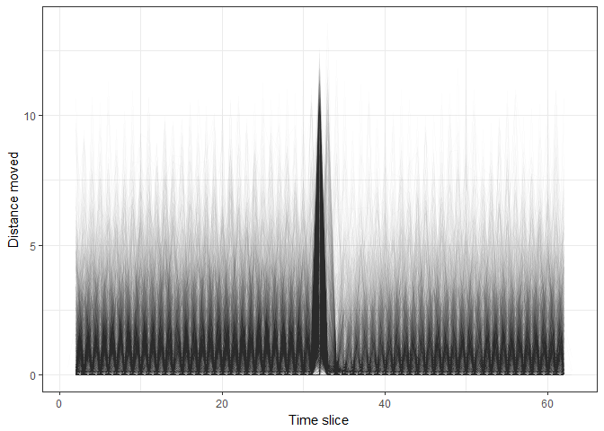

The only clear pattern is the peak in copepod movement around a minute in (slice 32). This was part of the experiment. Copepods were in well-plates and the plates were dropped a couple mm in a standardized way to 'shock' or 'surprise' the copepods and then observe their reaction and recovery. The typical pattern can be seen more clearly when we just look at the average.

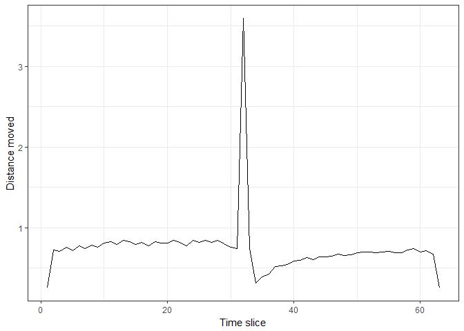

After being dropped, copepods tend to remain still, which is a typical anti-predator response. They then slowly begin moving again, eventually reaching the level of movement seen previous to the 'shock'.

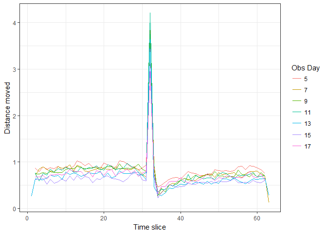

There does not appear to be pronounced differences between observation days, so we'll assume that the above pattern is a reasonable expectation for all the problematic copepods. Turning our attention to those problematic copepods...

There are 69 copepods with the wrong number of observations. Here is a histogram of their distribution. A group of copepods with less than 50 observations stands out; this was due to a mistake with the video recording (too short). In most cases, just one observation is missing (61 instead of 62).

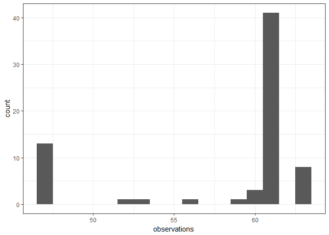

A small group of copepods was characterized by too many observations.

    ## [1] "39_1B_7"  "74_1B_13" "74_1C_13" "74_2B_13" "74_3A_13" "74_3D_13"
    ## [7] "74_4A_13" "74_5D_13"

The first copepod in this list, 39\_1B, was identified as suspicious in the [first exploration](quality_control_behav_data1.ipynb) of the data, because it was not in the videography table. When we plot it, we see that the behavior of this copepod look suspicious; there is no clear peak when dropped and it becomes more active after the drop.

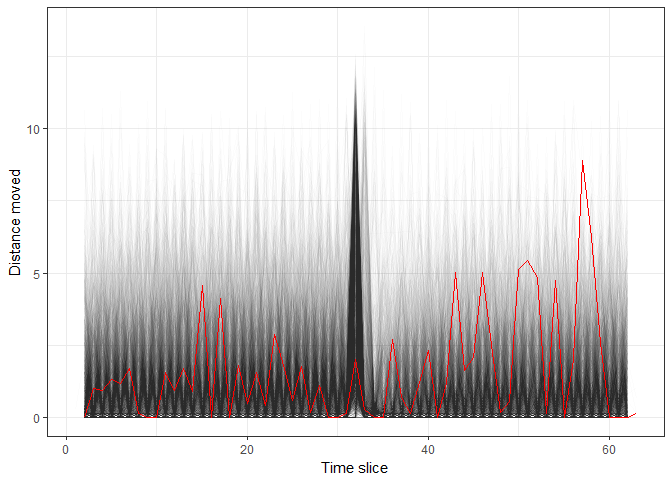

This makes me skeptical about two other videos, 66\_1B\_9 and 50\_6D\_7, that had the same problem: behavioral data without an entry in the videography table. They could probably be removed, since they were only observed on a single day and they were in the least important treatment group.

The other copepods that had too many observations were all from plate 74, day 13. In this case, the peak seems to be in the right place, so I feel confident in simply removing the final observation from the raw data.

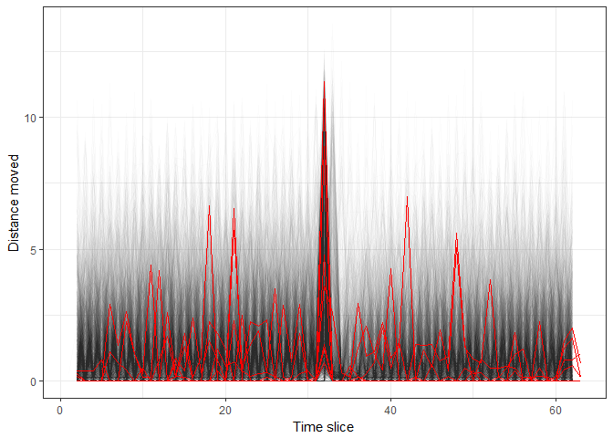

Now let's look at the copepods with too few obervations. There are quite a few (n = 61), so it's a good idea to look for groups that likely have a common underlying cause, such as being on the same plate like copepods from plate 5, day 11 (`05_**_11`) or plate 61, day 9 (`61_**_9`).

    ##  [1] "05_1D_11" "05_2C_11" "05_2D_11" "05_3B_11" "05_4B_11" "05_4D_11"
    ##  [7] "05_5C_11" "05_6B_11" "05_6C_11" "09_1C_5"  "09_5D_5"  "09_5D_7" 
    ## [13] "12_5D_11" "14_4D_5"  "18_4A_9"  "18_5B_9"  "18_5D_9"  "18_6C_9" 
    ## [19] "24_2C_5"  "25_3A_11" "26_6C_9"  "27_1D_5"  "28_3C_11" "29_1C_17"
    ## [25] "32_1A_13" "32_6A_5"  "33_2D_5"  "35_2D_7"  "35_6B_17" "39_2B_7" 
    ## [31] "39_6B_5"  "49_1C_13" "51_1D_11" "51_3D_11" "51_4B_11" "51_4C_11"
    ## [37] "51_5B_11" "51_6D_11" "52_1A_17" "53_2A_9"  "53_3C_9"  "53_4B_9" 
    ## [43] "53_5B_9"  "53_6A_9"  "53_6D_9"  "61_1A_9"  "61_1B_9"  "61_1D_9" 
    ## [49] "61_2A_9"  "61_2C_9"  "61_2D_9"  "61_3B_9"  "61_4A_9"  "61_4B_9" 
    ## [55] "61_5B_9"  "61_5C_9"  "61_6A_9"  "61_6B_9"  "63_1C_13" "63_3B_7" 
    ## [61] "66_6B_11"

I'll plot these groups separately to diagnose the potential problem, starting with plate 5 on day 11.

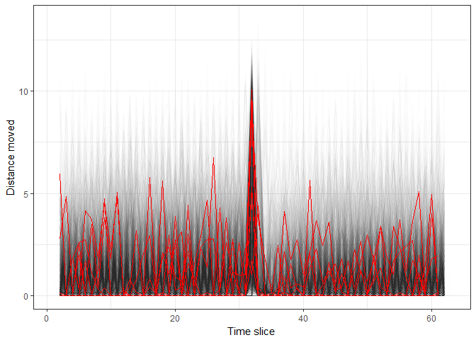

The pattern looks ok, with the peak being in the correct place and reduced movement thereafter. Presumably, the final observation is simply missing in these cases.

The next group, plate 9, day 5, also seems reasonable; look at the clear decrease in activity in the second half of observation. When I pulled up the raw data for these cases, they were missing slice 20 for some reason.

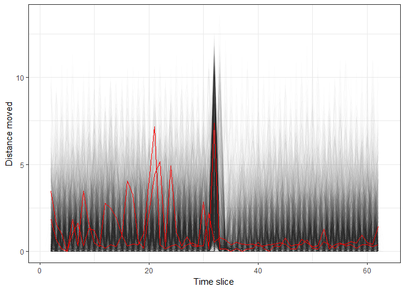

The next 4 cases are for plate 18, day 9. Strangely, they are missing movement data entirely!

This seems to be a mistake processing the videos. The files have x-y coordinates, but not distances, and the x-y coordinates are the same in all files. These copepods were recorded on other days, so this seems to be a one-time mistake. But it made me wonder if other copepods were missing behavior data. Besides those on plate 18, just one recording is missing data, 39\_2B\_7. It was also recorded on other days, so it seems to be a mistake with video processing.

    ## [1] "39_2B_7" "18_4A_9" "18_5B_9" "18_5D_9" "18_6C_9"

Next group: plate 51, day 11. Here, the peak seems to be in the correct spot, suggesting the last observation is just missing.

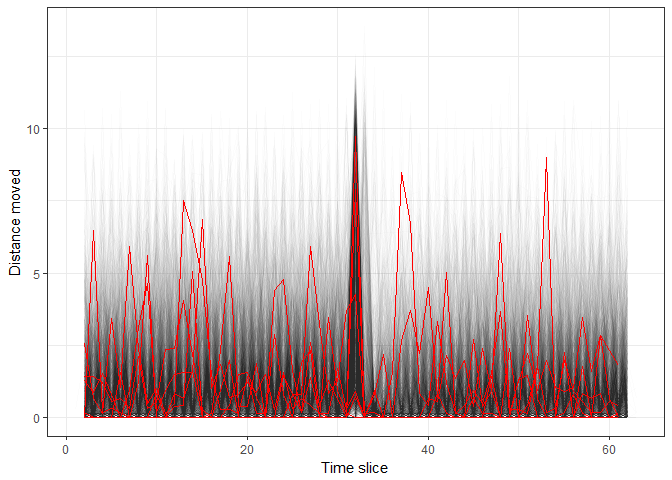

Same for the next group: plate 53, day 9. The pattern seems reasonable, so presumably the final observation is just missing by accident.

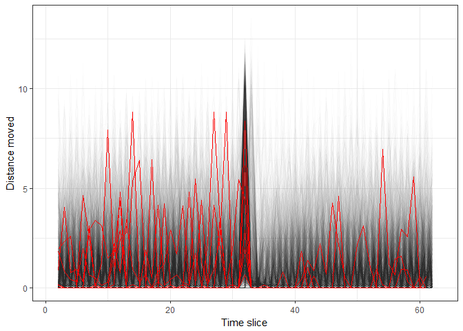

The next group, plate 61 day 9, is the plate with only 47 observations, because the video was too short. Still, the peak seems to be in the correct place, suggesting this group should be retained and treated as having missing data, rather than deleted outright.

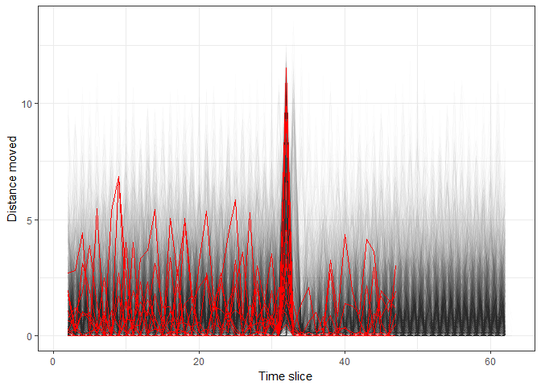

There are another 21 copepods with missing observations, but they are not obviously part of a group. Presumably, they each have their own idiosyncratic reason for missing data.

Nonetheless, at this point, I think the problematic cases fall into a couple of categories.

1.  *Copepods not in videography table*

-   n = 3. Suspicious behavior pattern, so delete these entries.

1.  *Too many observations*

-   n = 7. Few look suspicious, delete excessive observations.

1.  *Too few observations*

-   n = 38. Missing final observations, often line up well with expectations, so either accept missing data or reevaluate video files.
-   n = 22. Missing internal observations, but often line up with expectations, suggestive of video-processing error. Either accept as missing data, or reevaluate video files.

1.  *Missing all movement data*

-   n = 5. Reevaluate video files or accept as missing data.

So what to do? In each case, there are three options: delete the entries, accept the missing data, or reevaluate the video files. Deletion seems reasonable for the three cases where the copepods were not in the videography file; they were observed on only one of the seven observation days, presumably by accident. Their behavior also seems suspicious.

But deletion seems too extreme in most of the other cases, because the recordings usually lined up well with expectations, i.e. the peak was in the right place. Moreover, in the few cases where data were completely missing, this seems to be related to the recording and not the copepod itself, as later recordings of the copepod were not problematic. The best remedy would be 'correcting' the problems by reevaluating the videos. However, this is not an option in every case, because some videos were accidentally too short (e.g. plate 61 day 9). Thus, it is also worthwhile to categorize each case as simply missing data (e.g. due to recording problems) or as suspicious (e.g. behavior patterns that do not fit expectations). To help make these categorizations, here is a gif that loops through the problematic copepods that were not visualized above.

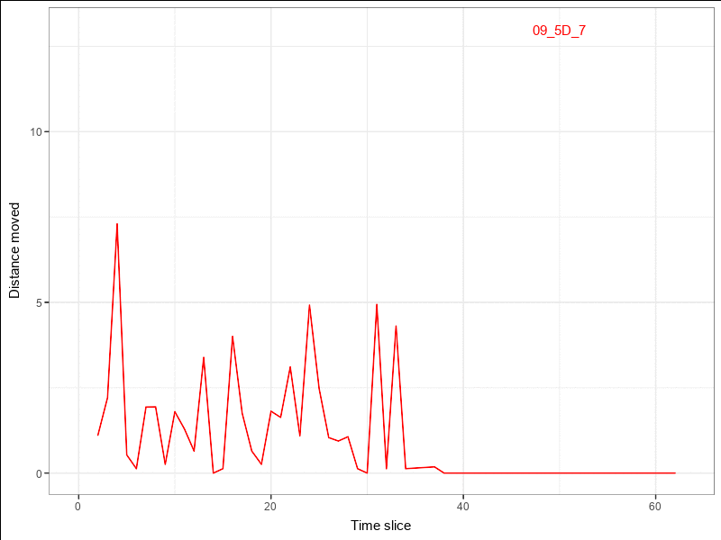

Often, the peak appears to be in the right place, but not always. Sometimes, activity increases with time, unlike expecations. I think to be confident in these problematic cases, it would be best to reevaluate the video files.

So we have explored the behavior patterns in recordings with too many or too few observations. But what about recordings with the correct number of observations? They could have incorrectly labeled time slices. For example, a recording might have the correct 62 observations, but only 61 unique slice/time values, due to a slice being duplicated. Let's check for recordings with this problem. There are 21 such cases.

| fname      | problem            |
|:-----------|:-------------------|
| 07\_2D\_5  | duplicate slice 35 |
| 07\_3B\_11 | duplicate slice 23 |
| 24\_4D\_11 | duplicate slice 44 |
| 28\_6A\_11 | duplicate slice 32 |
| 29\_5B\_15 | duplicate slice 57 |
| 32\_4C\_15 | duplicate slice 32 |
| 33\_5A\_9  | duplicate slice 24 |
| 33\_5A\_9  | duplicate slice 25 |
| 34\_2A\_13 | duplicate slice 52 |
| 39\_6A\_13 | duplicate slice 1  |
| 42\_2B\_5  | duplicate slice 32 |
| 44\_1B\_9  | duplicate slice 53 |
| 44\_1C\_9  | duplicate slice 52 |
| 47\_4C\_7  | duplicate slice 14 |
| 47\_6B\_7  | duplicate slice 32 |
| 55\_1B\_9  | duplicate slice 32 |
| 55\_1C\_5  | duplicate slice 7  |
| 55\_3A\_5  | duplicate slice 60 |
| 55\_5C\_17 | duplicate slice 32 |
| 66\_4A\_11 | duplicate slice 52 |
| 66\_4A\_11 | duplicate slice 53 |

There is also no obvious pattern. The duplications occur in different plates, on different days, and in different slices, which is suggestive of human error rather than anything systematic. An obvious question is whether behavior values are the same between duplicated slices, which would suggest a whole row in the raw data was simply copied.

| fname      |  duplicate\_slice|      1|       2|
|:-----------|-----------------:|------:|-------:|
| 07\_2D\_5  |                35|  1.677|   4.724|
| 07\_3B\_11 |                23|  3.523|   0.258|
| 24\_4D\_11 |                44|  0.816|   4.336|
| 28\_6A\_11 |                32|  0.000|   5.432|
| 29\_5B\_15 |                57|  0.516|   0.129|
| 32\_4C\_15 |                32|  0.912|  10.965|
| 33\_5A\_9  |                24|  4.296|   0.000|
| 33\_5A\_9  |                25|  0.182|   0.000|
| 34\_2A\_13 |                52|  0.000|   0.182|
| 39\_6A\_13 |                 1|     NA|   0.258|

This was not the case. Activity clearly differed among the multiple measurements on a single slice (compare column `1` vs `2` in the table above). This suggests that slice was mislabeled for some reason in the raw data, not that entire rows were copied. I think the best way to remedy these 'duplication' cases, would be to re-evaluate a subsample of the videos to check if the duplicate rows are simply mislabeled.

Conclusions
===========

We have identified some problems (wrong number of rows, missing observations, duplicate slices) and suggested solutions (deletion, reevaluate videos, accept as missing, etc). In total, 90 recordings were considered problematic. This final table summarizes the action taken in each case.

| fname      | problem                                | action                                    |
|:-----------|:---------------------------------------|:------------------------------------------|
| 05\_1D\_11 | missing final obs                      | reevalute video or deal with missing data |
| 05\_2C\_11 | missing final obs                      | reevalute video or deal with missing data |
| 05\_2D\_11 | missing final obs                      | reevalute video or deal with missing data |
| 05\_3B\_11 | missing final obs                      | reevalute video or deal with missing data |
| 05\_4B\_11 | missing final obs                      | reevalute video or deal with missing data |
| 05\_4D\_11 | missing final obs                      | reevalute video or deal with missing data |
| 05\_5C\_11 | missing final obs                      | reevalute video or deal with missing data |
| 05\_6B\_11 | missing final obs                      | reevalute video or deal with missing data |
| 05\_6C\_11 | missing final obs                      | reevalute video or deal with missing data |
| 07\_2D\_5  | duplicate slice 35                     | reevaluate video, revise slice values     |
| 07\_3B\_11 | duplicate slice 23                     | reevaluate video, revise slice values     |
| 09\_1C\_5  | missing 20                             | reevalute video or deal with missing data |
| 09\_5D\_5  | missing 20                             | reevalute video or deal with missing data |
| 09\_5D\_7  | missing 35 to 36                       | reevalute video or deal with missing data |
| 12\_5D\_11 | missing 23 to 31                       | reevalute video or deal with missing data |
| 14\_4D\_5  | missing 55                             | reevalute video or deal with missing data |
| 18\_4A\_9  | missing behav data; missing final obs  | reevalute video or deal with missing data |
| 18\_5B\_9  | missing behav data; missing final obs  | reevalute video or deal with missing data |
| 18\_5D\_9  | missing behav data; missing final obs  | reevalute video or deal with missing data |
| 18\_6C\_9  | missing behav data; missing final obs  | reevalute video or deal with missing data |
| 24\_2C\_5  | missing 44                             | reevalute video or deal with missing data |
| 24\_4D\_11 | duplicate slice 44                     | reevaluate video, revise slice values     |
| 25\_3A\_11 | missing 15 to 24                       | reevalute video or deal with missing data |
| 26\_6C\_9  | missing 24                             | reevalute video or deal with missing data |
| 27\_1D\_5  | missing 35 to 37                       | reevalute video or deal with missing data |
| 28\_3C\_11 | missing 26 to 31                       | reevalute video or deal with missing data |
| 28\_6A\_11 | duplicate slice 32                     | reevaluate video, revise slice values     |
| 29\_1C\_17 | missing 9                              | reevalute video or deal with missing data |
| 29\_5B\_15 | duplicate slice 57                     | reevaluate video, revise slice values     |
| 32\_1A\_13 | missing 42                             | reevalute video or deal with missing data |
| 32\_4C\_15 | duplicate slice 32                     | reevaluate video, revise slice values     |
| 32\_6A\_5  | missing 41                             | reevalute video or deal with missing data |
| 33\_2D\_5  | missing 54 to 55                       | reevalute video or deal with missing data |
| 33\_5A\_9  | duplicate slice 24; duplicate slice 25 | reevaluate video, revise slice values     |
| 34\_2A\_13 | duplicate slice 52                     | reevaluate video, revise slice values     |
| 35\_2D\_7  | missing 16                             | reevalute video or deal with missing data |
| 35\_6B\_17 | missing 28                             | reevalute video or deal with missing data |
| 39\_1B\_7  | not in videography table; too many obs | delete                                    |
| 39\_2B\_7  | missing behav data; missing final obs  | reevalute video or deal with missing data |
| 39\_6A\_13 | duplicate slice 1                      | reevaluate video, revise slice values     |
| 39\_6B\_5  | missing 26                             | reevalute video or deal with missing data |
| 42\_2B\_5  | duplicate slice 32                     | reevaluate video, revise slice values     |
| 44\_1B\_9  | duplicate slice 53                     | reevaluate video, revise slice values     |
| 44\_1C\_9  | duplicate slice 52                     | reevaluate video, revise slice values     |
| 47\_4C\_7  | duplicate slice 14                     | reevaluate video, revise slice values     |
| 47\_6B\_7  | duplicate slice 32                     | reevaluate video, revise slice values     |
| 49\_1C\_13 | missing 53                             | reevalute video or deal with missing data |
| 50\_6D\_7  | not in videography table               | delete                                    |
| 51\_1D\_11 | missing final obs                      | reevalute video or deal with missing data |
| 51\_3D\_11 | missing final obs                      | reevalute video or deal with missing data |
| 51\_4B\_11 | missing final obs                      | reevalute video or deal with missing data |
| 51\_4C\_11 | missing final obs                      | reevalute video or deal with missing data |
| 51\_5B\_11 | missing final obs                      | reevalute video or deal with missing data |
| 51\_6D\_11 | missing final obs                      | reevalute video or deal with missing data |
| 52\_1A\_17 | missing 32                             | reevalute video or deal with missing data |
| 53\_2A\_9  | missing final obs                      | reevalute video or deal with missing data |
| 53\_3C\_9  | missing final obs                      | reevalute video or deal with missing data |
| 53\_4B\_9  | missing final obs                      | reevalute video or deal with missing data |
| 53\_5B\_9  | missing final obs                      | reevalute video or deal with missing data |
| 53\_6A\_9  | missing final obs                      | reevalute video or deal with missing data |
| 53\_6D\_9  | missing final obs                      | reevalute video or deal with missing data |
| 55\_1B\_9  | duplicate slice 32                     | reevaluate video, revise slice values     |
| 55\_1C\_5  | duplicate slice 7                      | reevaluate video, revise slice values     |
| 55\_3A\_5  | duplicate slice 60                     | reevaluate video, revise slice values     |
| 55\_5C\_17 | duplicate slice 32                     | reevaluate video, revise slice values     |
| 61\_1A\_9  | missing final obs                      | accept missing 15 final obs               |
| 61\_1B\_9  | missing final obs                      | accept missing 15 final obs               |
| 61\_1D\_9  | missing final obs                      | accept missing 15 final obs               |
| 61\_2A\_9  | missing final obs                      | accept missing 15 final obs               |
| 61\_2C\_9  | missing final obs                      | accept missing 15 final obs               |
| 61\_2D\_9  | missing final obs                      | accept missing 15 final obs               |
| 61\_3B\_9  | missing final obs                      | accept missing 15 final obs               |
| 61\_4A\_9  | missing final obs                      | accept missing 15 final obs               |
| 61\_4B\_9  | missing final obs                      | accept missing 15 final obs               |
| 61\_5B\_9  | missing final obs                      | accept missing 15 final obs               |
| 61\_5C\_9  | missing final obs                      | accept missing 15 final obs               |
| 61\_6A\_9  | missing final obs                      | accept missing 15 final obs               |
| 61\_6B\_9  | missing final obs                      | accept missing 15 final obs               |
| 63\_1C\_13 | missing 30                             | reevalute video or deal with missing data |
| 63\_3B\_7  | missing 53                             | reevalute video or deal with missing data |
| 66\_1B\_9  | not in videography table               | delete                                    |
| 66\_4A\_11 | duplicate slice 52; duplicate slice 53 | reevaluate video, revise slice values     |
| 66\_6B\_11 | missing 26 to 27                       | reevalute video or deal with missing data |
| 74\_1B\_13 | too many obs                           | remove extra obs from raw data            |
| 74\_1C\_13 | too many obs                           | remove extra obs from raw data            |
| 74\_2B\_13 | too many obs                           | remove extra obs from raw data            |
| 74\_3A\_13 | too many obs                           | remove extra obs from raw data            |
| 74\_3D\_13 | too many obs                           | remove extra obs from raw data            |
| 74\_4A\_13 | too many obs                           | remove extra obs from raw data            |
| 74\_5D\_13 | too many obs                           | remove extra obs from raw data            |
